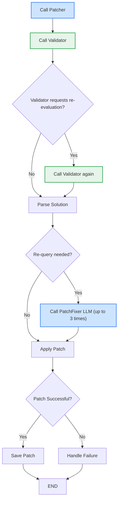

# CodeGPT SWE-Bench Results


## Directory Structure

```
.
├── data
│   └── results                                
│       ├── RUN_NAME               # Run by model 
│       │   ├── diffs              # Diff file per instance
│       │   ├── errors             # Error message (if any)
│       │   ├── patches            # Patch & fuzzy matching
│       │   └── trajs              # MultiAgent trajectories 
│       └── swe-bench              # SWE-Bench results for RUN_NAME
├── notebooks
│   ├── 00_create_graphs.ipynb     # Create graph for each instance
│   ├── 01_test_prompt.ipynb       # Test with a single instance 
│   ├── 02_get_patches.ipynb       # Get patches for all (30) instances
│   ├── 03_summarise_results.ipynb # Summarise results
│   ├── CodeGPT_Patcher.py         # MultiAgent Approach
│   └── utils.py                   # Utility functions
├── prompts
│   ├── agents.ts                  # MultiAgent prompts
│   └── tools_description.ts       # Tools description
├── README.md
└── requirements.txt
```

## Prompts

The prompts stored in [`prompts\agents.ts`](prompts/agents.ts) are the ones used depending on the `agentType` parameter (see [`notebooks\CodeGPT_Patcher.py`](notebooks/CodeGPT_Patcher.py) file for details) of the API.
| agentType | Prompt |
| --- | --- |
| `patcher` | `patcherSystemPrompt` |
| `validator` | `validatorSystemPrompt` |
| `patcherFixer` | `patchFixerSystemPrompt` |

As can you note, all prompts contain a 1-shot example of the output:
```
<replace file=src/foo.py>
@@REPLACE@@
import os
import sys
@@WITH@@
import os
import sys
import json
import datetime
from typing import List, Dict
@@REPLACE@@
def calculate_sum(a, b):
    result = a + b
    return result
@@WITH@@
def calculate_sum(a, b):
    result = a + b
    print(f"Sum calculated: {result}")
    return result
@@REPLACE@@
class DataProcessor:
    def __init__(self):
        self.status = "idle"
        self.data = []
    
    def process(self, item):
        self.data.append(item)
@@WITH@@
class DataProcessor:
    def __init__(self):
        self.status = "ready"
        self.data = []
        self.processed_count = 0
    
    def process(self, item):
        self.data.append(item)
        self.processed_count += 1
</replace>
```

## Multi Agent Logic



## Running swe-bench

After executing the `02_get_patches.ipynb` notebook, you can run the following command inside the SWE-bench repo to evaluate the results:

```
RUN_NAME=CodeGPT_MultiAgent_Llama4_Maverick
python -m swebench.harness.run_evaluation \
    --predictions_path /home/pudu/judini/swe-bench/data/results/$RUN_NAME.jsonl \
    --max_workers 2
``` 