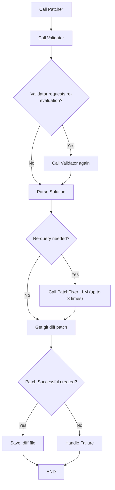
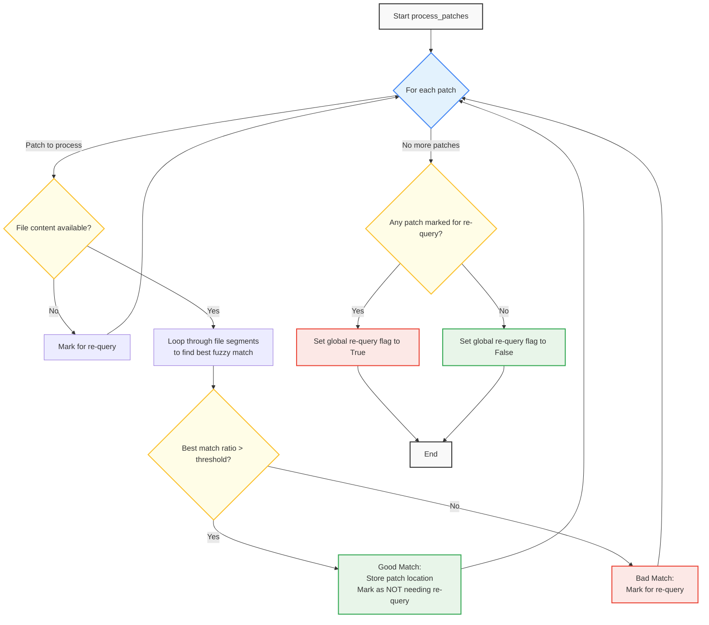

# CodeGPT SWE-Bench Results

This repository contains the implementation and results of CodeGPT's approach to solving a subset of SWE-Bench instances using a multi-agent system. The solution employs three specialized agents - a Patcher, Validator, and PatchFixer. The system uses fuzzy matching with Levenshtein ratio for patch application and include notebooks for analyzing performance on the SWE-Bench dataset.

30 instances were randomly selected:
```py
>>> instance_ids = merged_df.sample(30).index
>>> instance_ids
 ['django__django-15781', 'django__django-12125',
  'scikit-learn__scikit-learn-11040', 'sympy__sympy-21614',
  'sphinx-doc__sphinx-8595', 'django__django-12856',
  'django__django-17087', 'matplotlib__matplotlib-26011',
  'django__django-12589', 'pydata__xarray-4094',
  'pylint-dev__pylint-6506', 'scikit-learn__scikit-learn-25747',
  'django__django-14382', 'psf__requests-3362', 'sympy__sympy-23262',
  'sympy__sympy-13895', 'django__django-11049', 'pydata__xarray-4493',
  'matplotlib__matplotlib-23987', 'sympy__sympy-16106',
  'django__django-15498', 'pytest-dev__pytest-5227', 'sympy__sympy-21847',
  'sympy__sympy-13773', 'django__django-14997', 'sympy__sympy-19007',
  'pytest-dev__pytest-5221', 'sphinx-doc__sphinx-8721',
  'sympy__sympy-13031', 'scikit-learn__scikit-learn-13497']
```

- Llama 4 - Maverick results: [`data/results/CodeGPT_MultiAgent_Llama4_Maverick`](./data/results/CodeGPT_MultiAgent_Llama4_Maverick)
- Claude Opus 4 results:  [`data/results/CodeGPT_MultiAgent_Opus4`](./data/results/CodeGPT_MultiAgent_Opus4)

## Directory Structure

```
.
├── data
│   └── results                                
│       ├── RUN_NAME               # Run by model 
│       │   ├── diffs              # Diff file per instance
│       │   ├── errors             # Error message (if any)
│       │   ├── patches            # Patch & fuzzy matching
│       │   └── trajs              # MultiAgent trajectories 
│       └── swe-bench              # SWE-Bench results for RUN_NAME
├── notebooks
│   ├── 00_create_graphs.ipynb     # Create graph for each instance
│   ├── 01_test_prompt.ipynb       # Test with a single instance 
│   ├── 02_get_patches.ipynb       # Get patches for all (30) instances
│   ├── 03_summarise_results.ipynb # Summarise results
│   ├── CodeGPT_Patcher.py         # MultiAgent Approach
│   └── utils.py                   # Utility functions
├── prompts
│   ├── agents.ts                  # MultiAgent prompts
│   └── tools_description.ts       # Tools description
├── README.md
└── requirements.txt
```

## Prompts

The prompts stored in [`prompts\agents.ts`](prompts/agents.ts) are used depending on the `agentType` parameter (see [`notebooks\CodeGPT_Patcher.py`](notebooks/CodeGPT_Patcher.py) file for details) of the API.
| agentType | Prompt |
| --- | --- |
| `patcher` | `patcherSystemPrompt` |
| `validator` | `validatorSystemPrompt` |
| `patcherFixer` | `patchFixerSystemPrompt` |

As can you note, all prompts contain a 1-shot example of the desired output:
```
<replace file=src/foo.py>
@@REPLACE@@
import os
import sys
@@WITH@@
import os
import sys
import json
import datetime
from typing import List, Dict
@@REPLACE@@
def calculate_sum(a, b):
    result = a + b
    return result
@@WITH@@
def calculate_sum(a, b):
    result = a + b
    print(f"Sum calculated: {result}")
    return result
@@REPLACE@@
class DataProcessor:
    def __init__(self):
        self.status = "idle"
        self.data = []
    
    def process(self, item):
        self.data.append(item)
@@WITH@@
class DataProcessor:
    def __init__(self):
        self.status = "ready"
        self.data = []
        self.processed_count = 0
    
    def process(self, item):
        self.data.append(item)
        self.processed_count += 1
</replace>
```

## Multi Agent Logic



## Fuzzy Matching

The fuzzy matching logic is done using Levenshtein ratio, with a treshold of 0.98 (See [`notebooks\CodeGPT_Patcher.py` - `process_patches`](notebooks/CodeGPT_Patcher.py#L277) for details. )



The Levenshtein ratio is calculated as follows:

$$\large
\begin{align*}
s_1, s_2 : \text{input strings} \\
D = \text{Levenshtein distance}(s_1, s_2) \\
M = \text{max}(len(s_1), len(s_2)) - D \\
Ratio = \frac{2M}{len(s_1) + len(s_2)}
\end{align*}
$$

In our case $len(s_1) = len(s_2)$, so the ratio is simplified to:
$Ratio = \frac{len(s_1) - D}{len(s_1)}$


## Running swe-bench

After executing the `02_get_patches.ipynb` notebook, you can run the following command inside the SWE-bench repo to evaluate the results:

```
RUN_NAME=CodeGPT_MultiAgent_Llama4_Maverick
python -m swebench.harness.run_evaluation \
    --predictions_path /home/pudu/judini/swe-bench/data/results/$RUN_NAME.jsonl \
    --max_workers 2 \
    --run_id 0
``` 
